### Introduction

  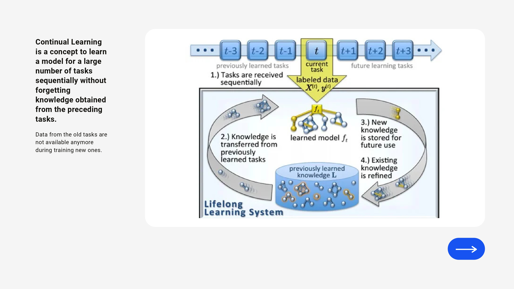

---
### Formalizing 'forgetting'

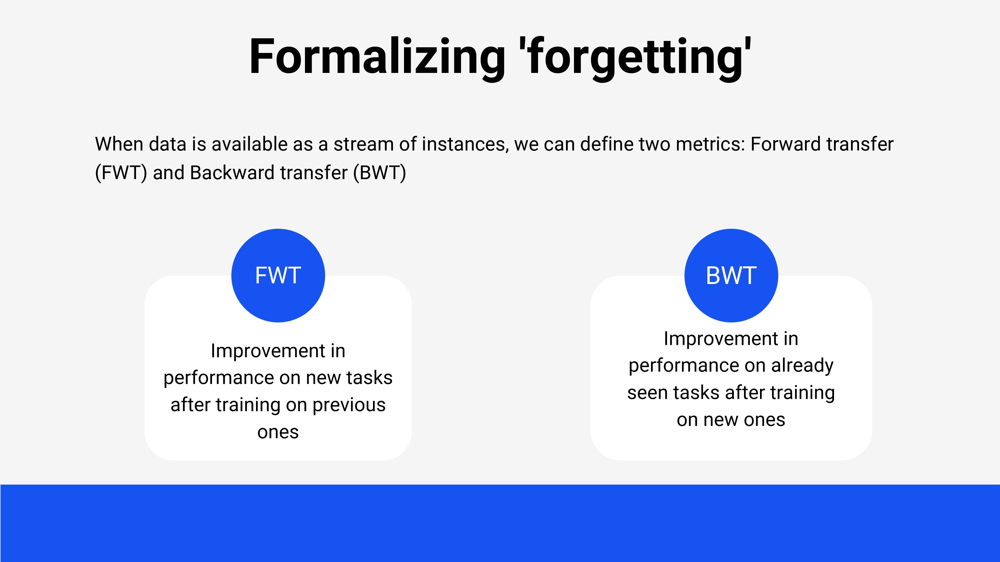

---
### Formalizing 'forgetting' (Cont.)

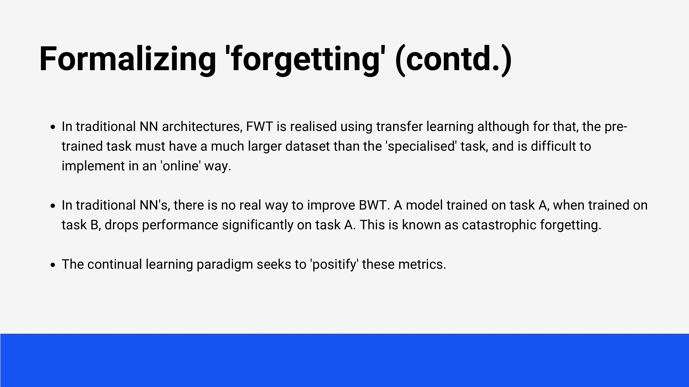

---
### Hypothesis

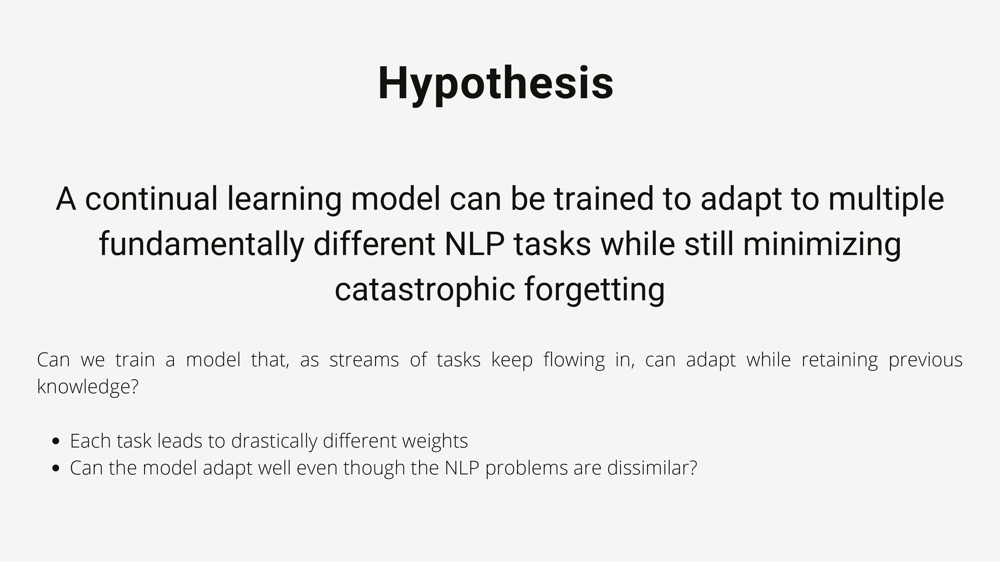

---
### Dataset

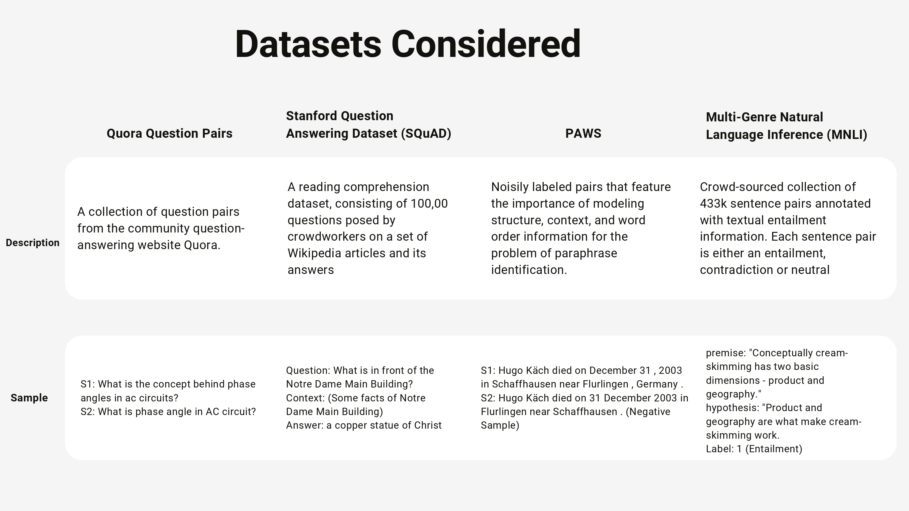

---
### Training setup
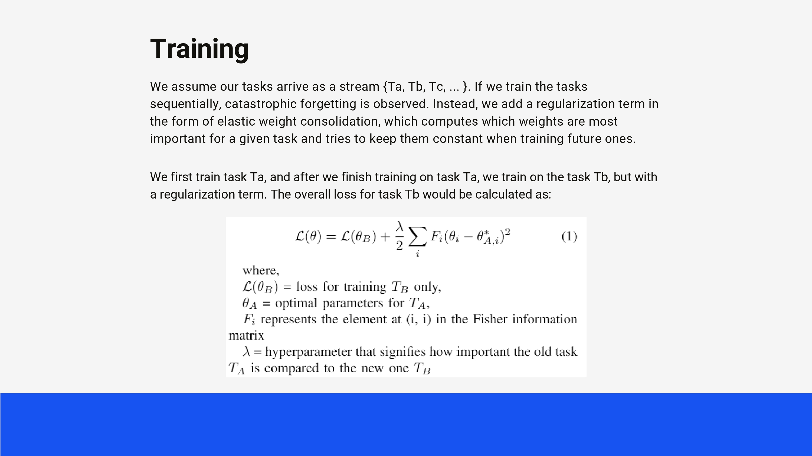

---
### Training setup (Cont.)
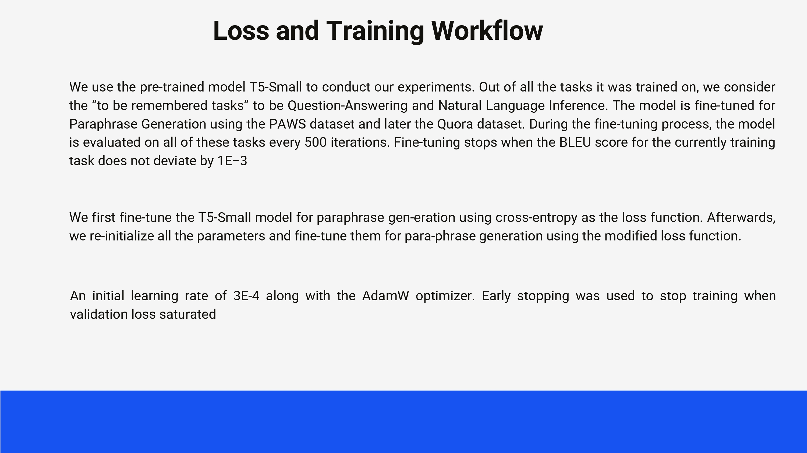

---
### The Original T5
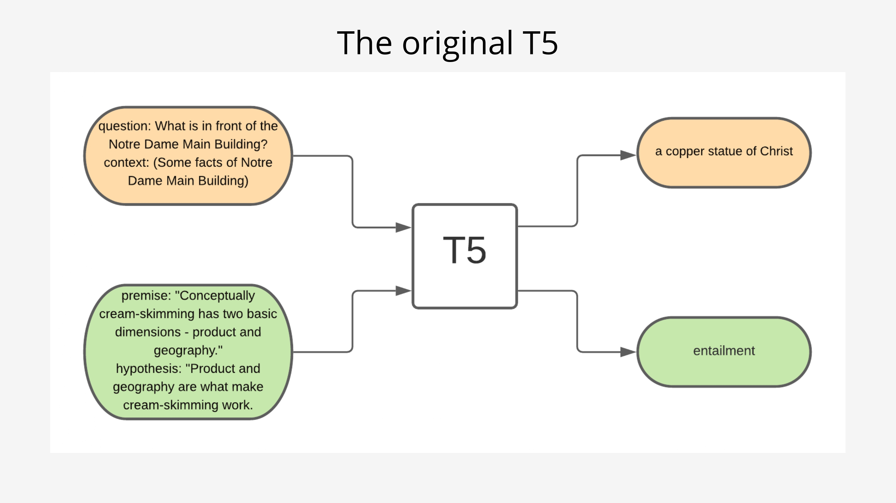

---
### T5 on standard fine-tuning
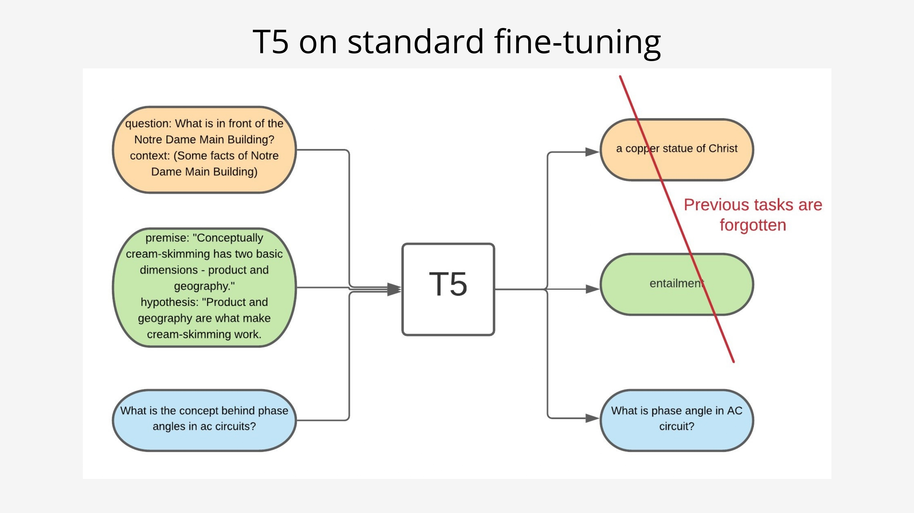

---
### T5 with EWC fine-tuning
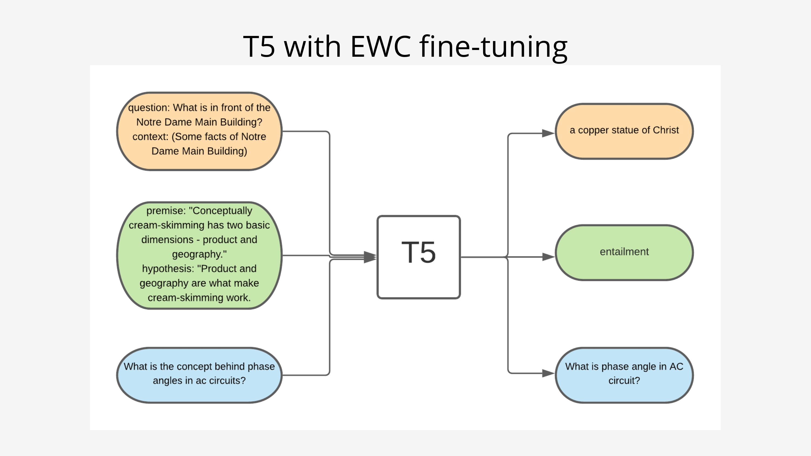

---
### Results
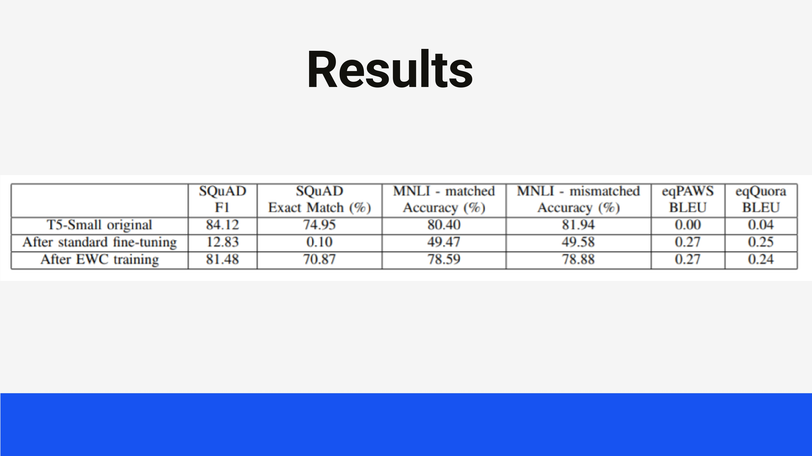

---
### Graphs
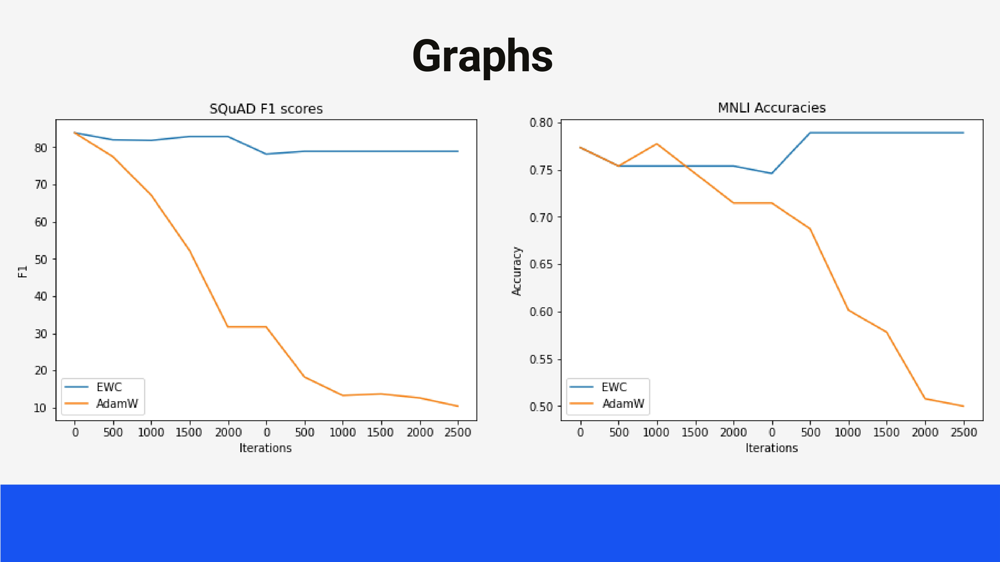

---
### Graphs (Cont.)
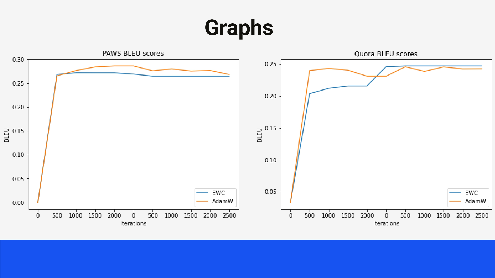

---
### Graphs (Cont.)
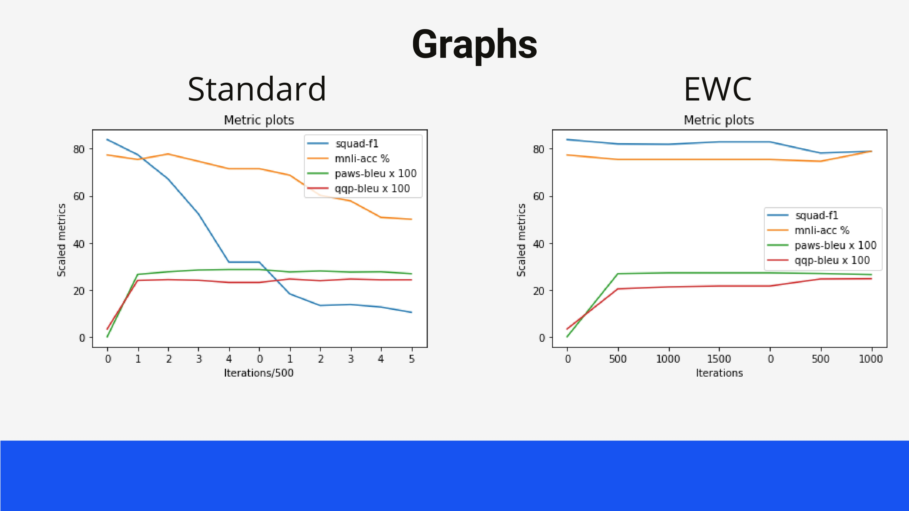

---
### Discussion on results
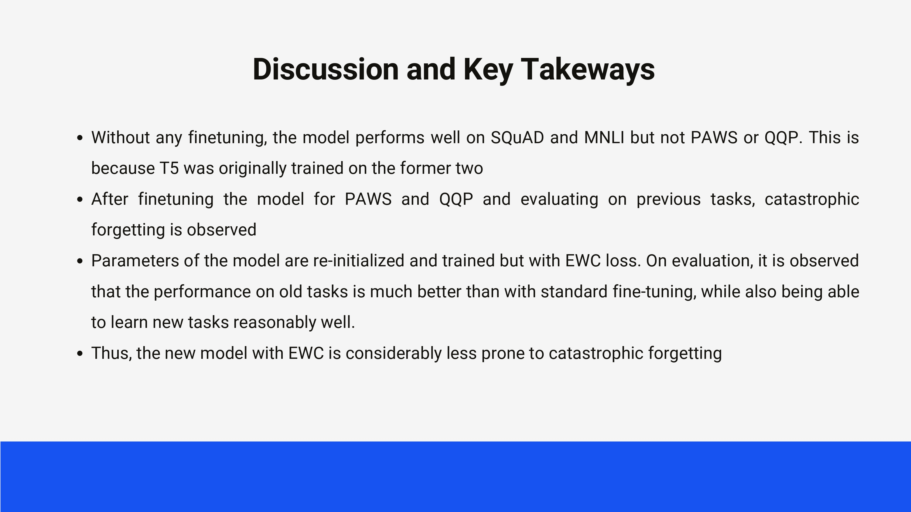

---
### Conclusion
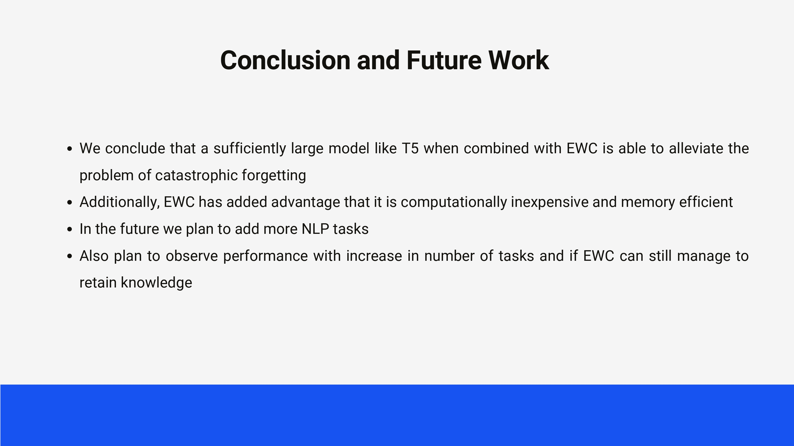

---
### References
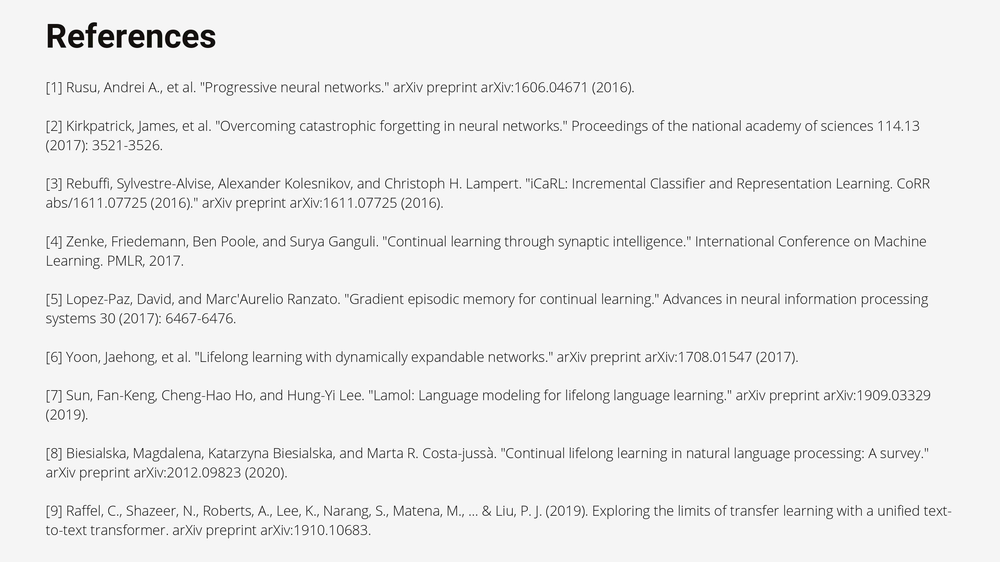